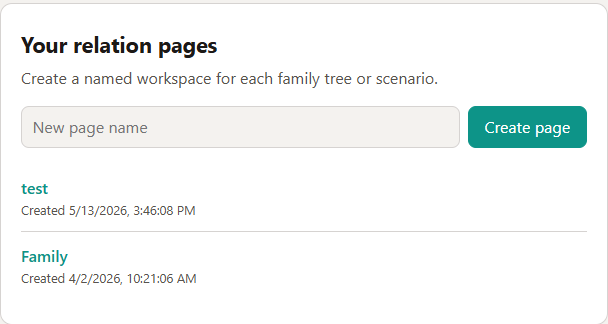
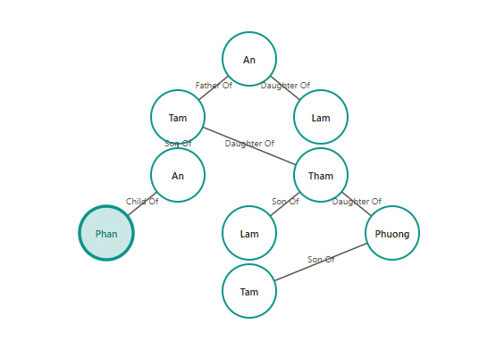
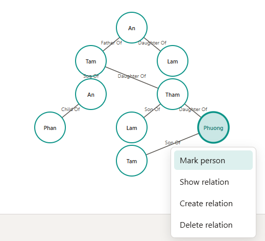
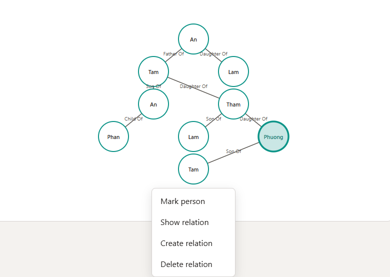
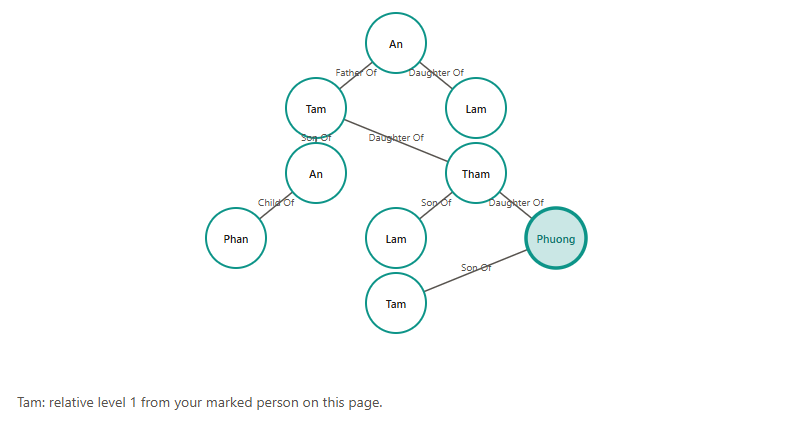

# Bac nao day

Quick project to create family tree and check member relation.

### Feature:
#### 1. Create family tree

#### 2. Display family tree

#### 3. Mark person

#### 4. And show relation

#### 5. Plan: Display relation role
Display specific role name instead of relative level number.